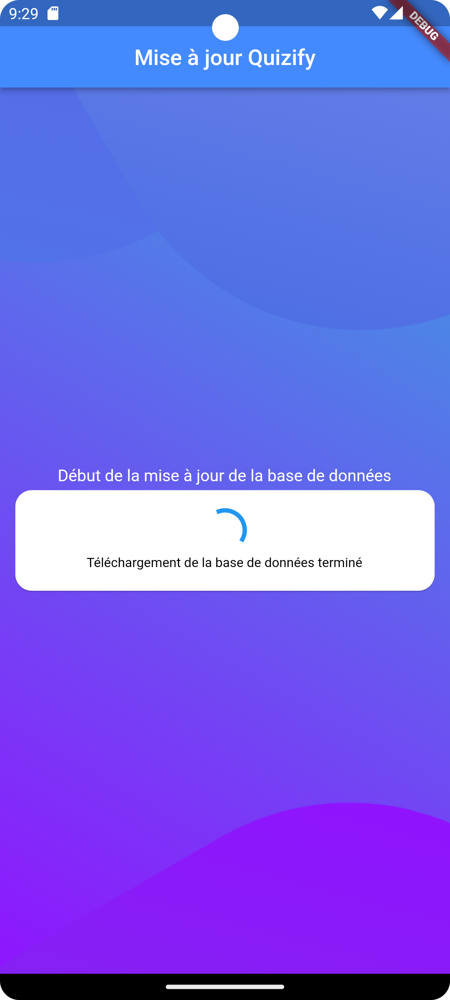
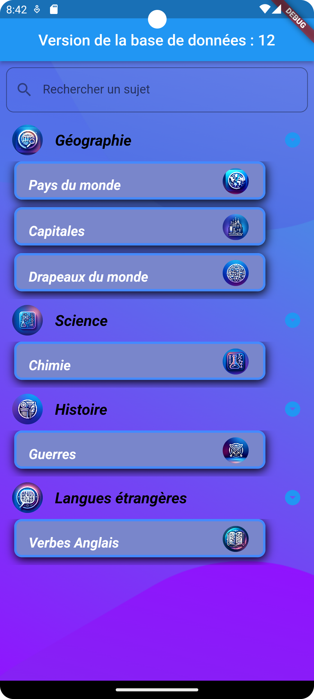
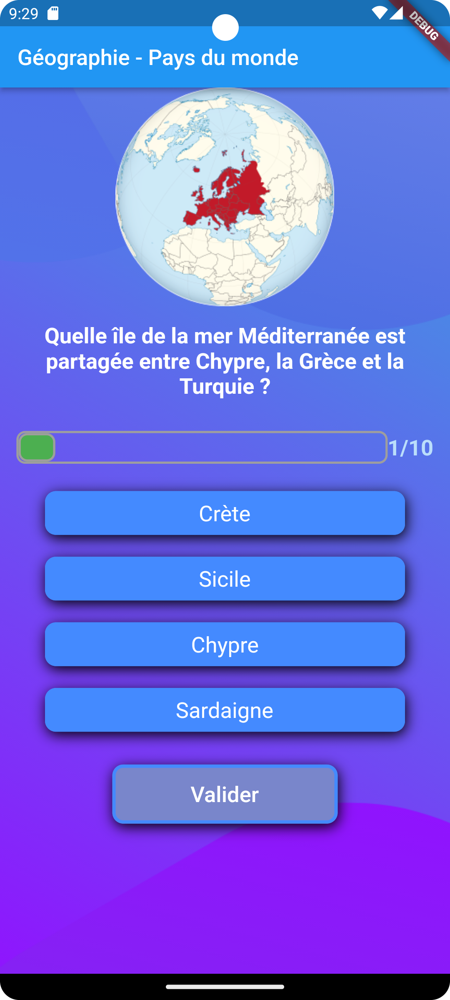
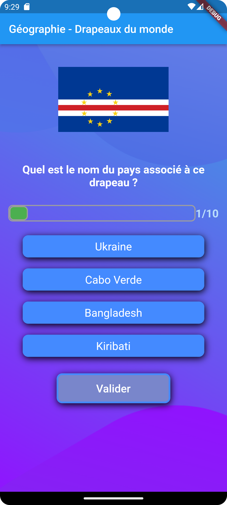
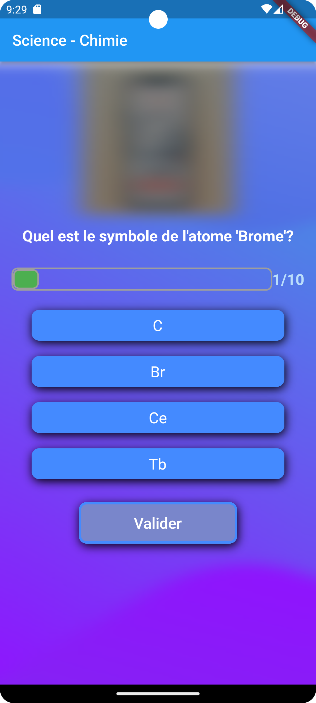
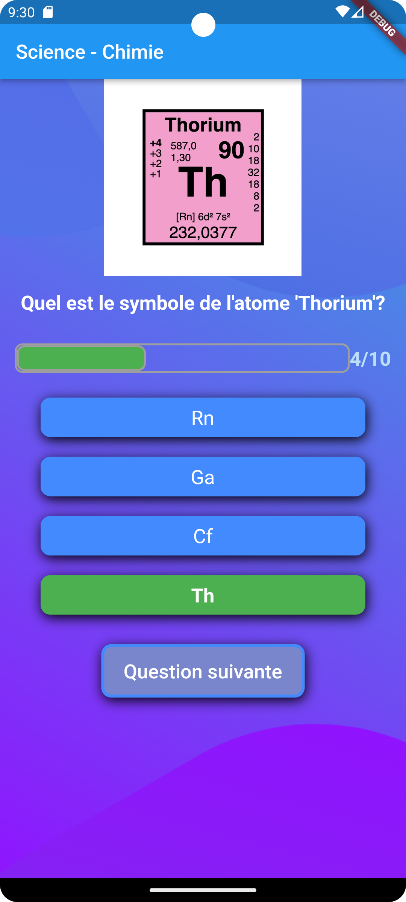
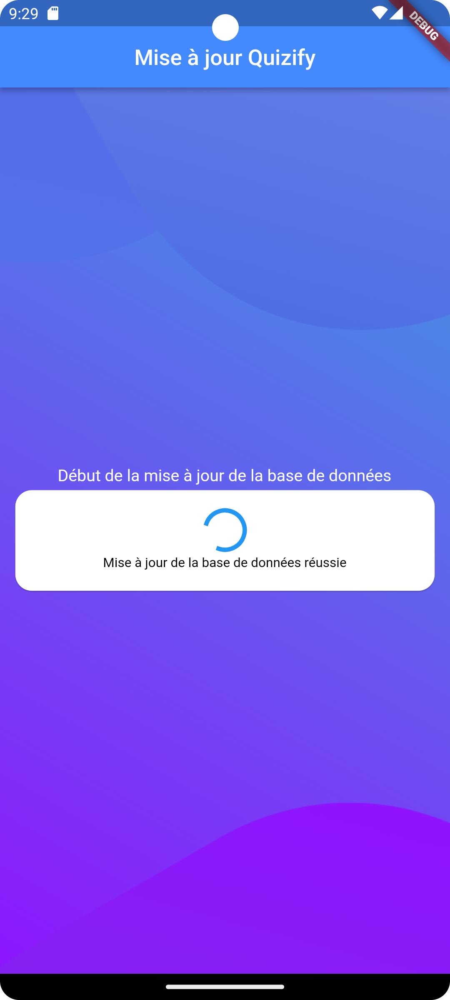
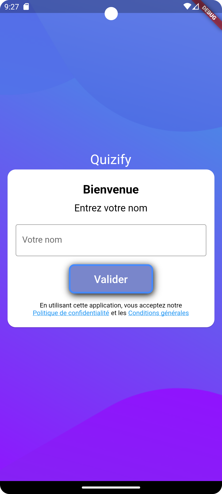

### Bonjour,👋 

En tant que développeur mobile, je suis passionné par la technologie et j'aime relever des défis tout en travaillant sur des tâches complexes. Mon domaine d'expertise englobe la conception et le développement d'applications mobiles, tout en nourrissant un vif intérêt pour des domaines innovants tels que la domotique.

  

## Me contacter

 
 

## Expertise

 
 

## Programming Languages

 
 

# Quizzy

Application de quiz interactive qui vous offre une variété de sujets et de catégories de quiz. Cette application a été développée dans le cadre d'un projet personnel visant à renforcer mes compétences en développement d'applications mobiles avec Flutter.

## Fonctionnalités principales :

- Génération dynamique de questions : Les questions du quiz sont générées à partir d'une source de données, permettant une personnalisation en fonction du sujet et de la catégorie choisis.

- Options de réponse générées aléatoirement.

- Barre de progression : Suivez votre progression dans le quiz grâce à une barre de progression qui indique la question en cours.

- Sélection d'options : Choisissez parmi les options de réponse en touchant l'écran, avec un changement de couleur pour indiquer votre sélection.

- Validation des réponses : Après avoir choisi une réponse et appuyé sur "Soumettre", la couleur de l'option change pour indiquer si la réponse est correcte ou incorrecte.

- Score : Votre score est calculé en fonction des réponses correctes et affiché à la fin du quiz.

- Mise à jour automatique de la base de données : L'application compare la version de la base de données du serveur avec celle locale, et effectue une mise à jour automatique si une version plus récente est disponible.

## Fonctionnalités à venir :

- Comparaison des scores : Je prévois d'ajouter une fonctionnalité de comparaison de votre score avec celui des autres joueurs. Voyez comment vous vous classez parmi les participants et peut-être même participez à un classement au niveau national.

## Technologies utilisées :

- Flutter : Le framework open-source de Google pour le développement d'applications multiplateformes.

- Dart : Le langage de programmation utilisé pour développer des applications Flutter.

## Comment utiliser l'application :

1. Sélectionnez un sujet et une catégorie pour commencer le quiz.

2. Répondez aux questions en sélectionnant l'une des options.

3. Appuyez sur le bouton "Soumettre" pour valider votre réponse.

4. Votre score sera calculé en fonction de vos réponses correctes.

5. À la fin du quiz, vous pourrez voir votre score final et relancer le quiz avec un nouveau sujet et une nouvelle catégorie.

### Compatible Android ou Ios

## Screenshots
<video src="presentationCourte.webm" controls>
  Désolé, ton navigateur ne supporte pas les vidéos embarquées.
</video>

### En cours de développement
