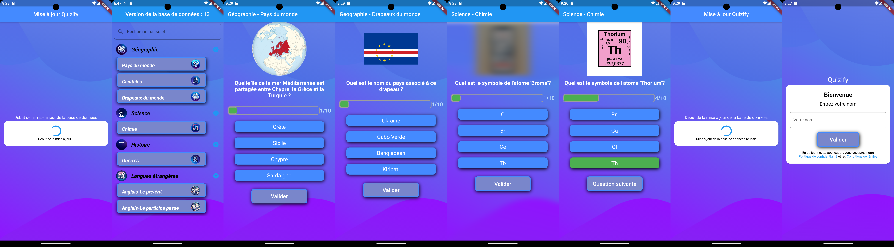

# Bonjour,👋

En tant que développeur Android, ma passion pour la technologie m'incite à explorer constamment de nouveaux horizons et relever des défis stimulants. Je me suis spécialisé dans la conception et développement d'applications mobiles, je m'efforce d'apporter des solutions innovantes et performantes. Je suis également passionné par des domaines innovants comme la domotique, source d'inspiration pour enrichir mes projets de fonctionnalités intelligentes et connectées.

## Me contacter

## Expertise

## Programming Languages

# Application de Quiz sur Flutter

## Introduction

Application quiz développée avec Flutter, conçue pour tester les connaissances dans divers domaines.

## Architecture et Conception

L'application repose sur une architecture robuste basée sur le modèle MVC (Modèle-Vue-Contrôleur), assurant une gestion claire de la base de données, la logique métier, et l'interface utilisateur.

### Points Forts de l'Architecture

#### Gestion de la Base de Données SQLite

L'application utilise SQLite pour stocker et gérer les données des quiz. Chaque mise à jour ajoute de nouvelles données importantes. Les scripts SQL importés sont exécutés pour des insertions précises, enrichissant ainsi constamment la base de données.

#### Programmation Asynchrone

Les `Futures` et `Streams` de Flutter sont utilisés pour une gestion efficace des opérations de base de données et de réseau, assurant une expérience utilisateur fluide.

#### FTP et Gestion de Fichiers

La fonctionnalité de connexion FTP permet de télécharger des fichiers pour la mise à jour régulière de la base de données. Ce processus comprend le téléchargement, la validation et le traitement des fichiers.

## Fonctionnalités Clés

- **Génération Dynamique de Quiz** : L'application permet de créer des quiz variés avec un mélange aléatoire de questions.
- **Interface Intuitive** : Une interface utilisateur attrayante et facile à naviguer.

# Quizzy

Application de quiz interactive offrant une variété de sujets et de catégories. Développée pour renforcer mes compétences en développement d'applications mobiles avec Flutter.

## Fonctionnalités principales

- Génération dynamique de questions.
- Barre de progression pour suivre la progression dans le quiz.
- Sélection d'options tactile avec changement de couleur pour indiquer la sélection.
- Validation des réponses et calcul du score.
- Mise à jour automatique de la base de données.

## Fonctionnalités à venir

- Comparaison des scores avec d'autres joueurs.

## Technologies utilisées

- Flutter et Dart pour le développement d'applications multiplateformes.

## Comment utiliser l'application

1. Sélectionnez un sujet et une catégorie pour commencer le quiz.
2. Répondez aux questions.
3. Appuyez sur "Soumettre" pour valider votre réponse.
4. Votre score est calculé en fonction des réponses correctes.
5. À la fin du quiz, visualisez votre score final.

### Compatible Android ou iOS

## Screenshots

<video src="presentationCourte.webm" controls> Désolé, votre navigateur ne supporte pas les vidéos embarquées. </video>

 

  <!-- Cette balise assure que le contenu suivant commence sur une nouvelle ligne. -->

## Autres Projets

<!-- Ajoute ici les liens et images pour tes autres projets. Exemple : -->

## .......
